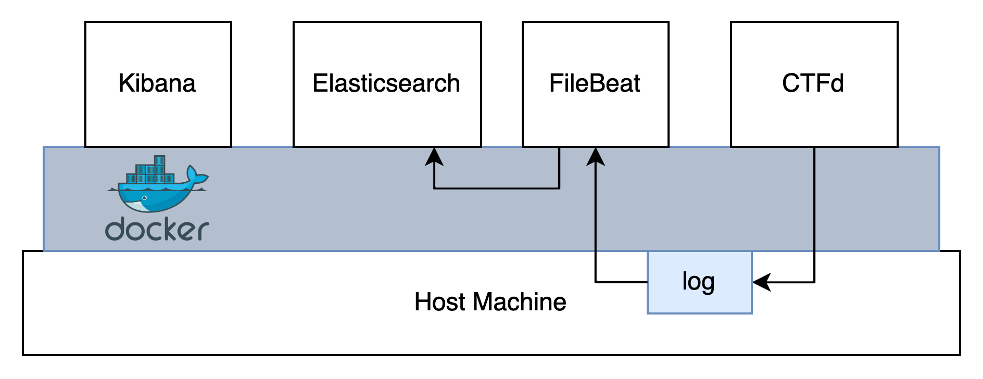

# CTFd3dViz
CTFd 3D Visualization

# Test
## Preparation for test environment

1. build CTFd
    - edit docker-compose.yml
    - set application as a user
2. build Elasticsearch and Kibana
    - set User/Password
    - no TLS
3. build Filebeat
4. cutomize Elasticsearch
    - create Ingest Pipelines

# Ref
- https://github.com/deviantony/docker-elk
- https://github.com/CTFd/CTFd
- https://docs.ctfd.io/
- https://github.com/kasug623/PollingElasticsearch